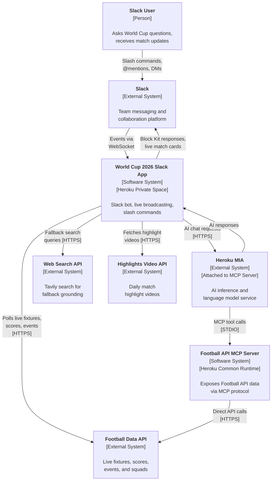
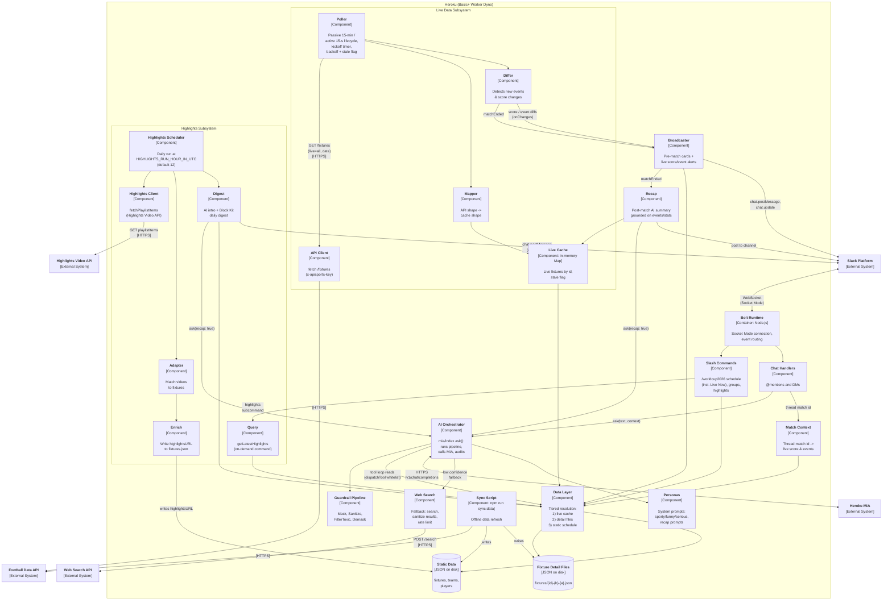
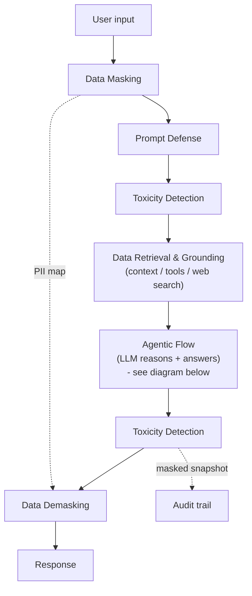
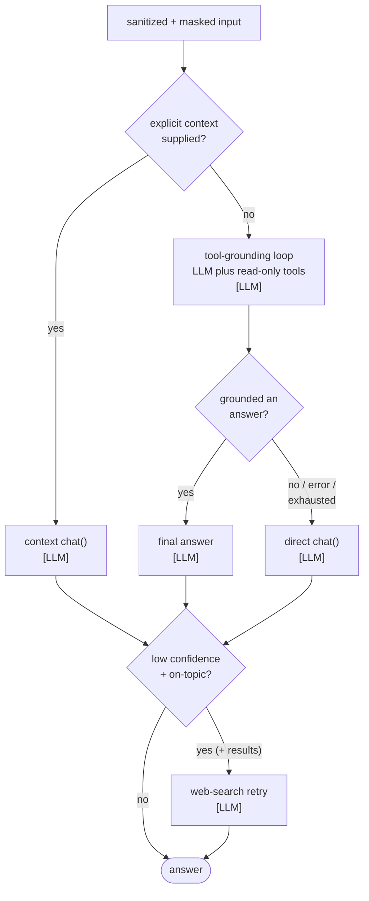
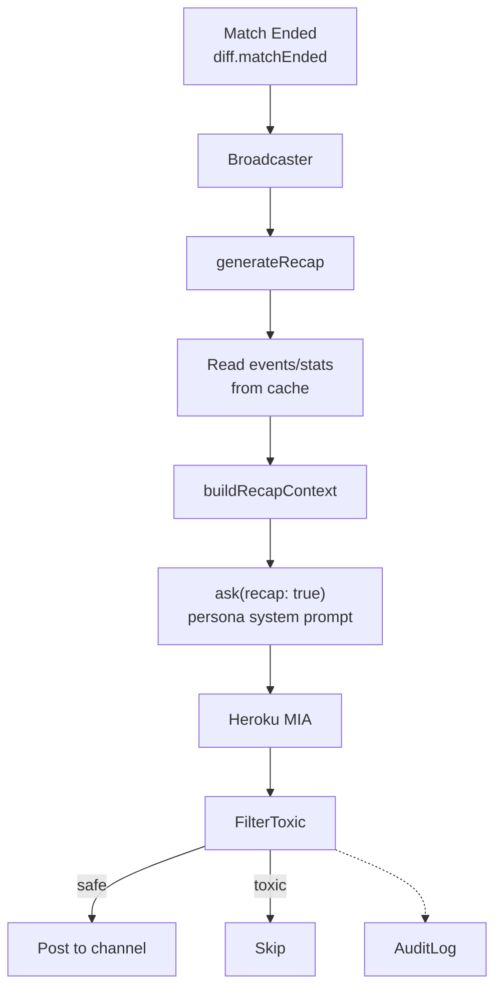
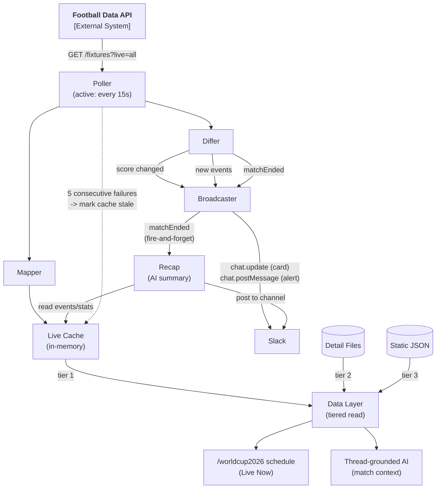

# Architecture Diagrams

## System Context Diagram (C4)

Legend:

- Software System (center) - The systems being documented
- External System - Third-party systems this system depends on
- Person - End user of the system

Deployment Model:

- Slack App: Heroku Private Space (`rb-heroku-mia-slack-worldcup26`)
- MCP Server: Heroku Common Runtime (`rb-mcp-football-server`)
- Inference Add-on: Attached to MCP Server app
- Private Space app uses MCP Server's INFERENCE_URL/KEY

## Container Diagram (C4)

## Trust Layer

The security pipeline wrapping every request. The diagram shows the safe path;
the core is one box, expanded in Agentic Flow below.

- Data Masking - PII replaced with tokens (`[EMAIL_1]`); map kept for demasking.
- Prompt Defense - strip injection attempts, system overrides, delimiter escapes.
- Toxicity Detection - whole-message guard (input + output); a match swaps the whole message for a fixed canned reply.
- Data Retrieval & Grounding - context, tool loop, or web search; see Agentic Flow below.
- Audit - logs the masked, pre-demask snapshot only; the demasked response is
  never written to the log, so PII is never persisted.
- Data Demasking - restores real PII into the user-facing response only; that
  response is never logged, so real PII exists only in the returned value.

## Agentic Flow

The Trust Layer's agentic core. Each `[LLM]` node is one model call; only the
context path can be a single call.

## Recap Flow

- Recap fires after final card is posted (fire-and-forget)
- Uses thread persona (sporty/funny/serious) for tone
- Grounded on full match events: goals, cards, subs, statistics
- Goes through ask() guardrails (toxic filter + audit) but no XML parsing
- Skips if the live cache is missing or stale, or the fixture is unknown

## Live Score

How live match data flows from the football API to Slack and grounded answers (see ADR-2).

- Poller: 15s while matches are live, 15-min passive checks otherwise. A precise kickoff
  timer (`scheduleKickoffActivation`) switches to active mode exactly at the next kickoff -
  zero wasted API calls, max 15s latency after kick.
- Tiered read (`src/data/index.js`): live cache for in-play, detail files for finished, static
  JSON for the schedule.
- Score change edits the card; new events post threaded alerts. 5 failed polls flag the cache
  stale ("data may be outdated").
- Match-end triggers recap generation (fire-and-forget): reads events/stats from cache, generates
  AI summary with persona tone, posts to match thread.
- Daily restart at a safe hour (`DAILY_RESTART_HOUR_IN_UTC`, default 11) resets in-memory
  dedup state and prevents Heroku's unpredictable 24h dyno cycling from landing mid-match.
